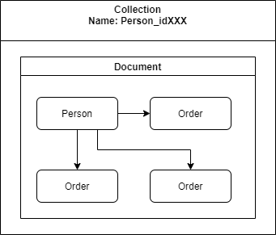
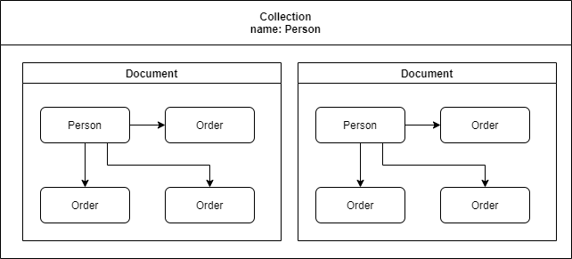

# Query by Collection or by Document

The purpose of this repo is to test query in MongoDB using __MongoDB.Driver__ for __.NETCore__.

## Architecture

This tests consists in  a benchmark run, making several queries in the base with 5000 records to verify which method is more faster.

We test the two ways how we can keep the data inside mongodb:

- Save the data by Collection:

  One person per collection. Each staff is a collection within the database, and their data is recorded within a document. The PersonId of that person is recorded in the name of the collection, thus generating a unique name.
  
  

  By the way, this method avoids searching for documents, by searching the collection while connecting to the database.

- Save the data by Document:

  Traditional model, saving each person in each document. One collection named Person.

  

## Test Requirements

 
 

All tests were did with the following specs:

- BenchmarkDotNet=v0.12.1
- OS=Windows 10.0.17763.1397 (1809/October2018Update/Redstone5)
- Intel Core i7-8665U CPU 1.90GHz (Coffee Lake), 1 CPU, 8 logical and 4 physical cores
- .NET Core SDK=3.1.401
- Job: .NET Core 3.1.7 (CoreCLR 4.700.20.36602, CoreFX 4.700.20.37001), X64 RyuJIT

The database was filled with 5000 records.

 
 
 

## Performance test with User by Collections

| Method       | qty    |          Mean |        Error |        StdDev |           Min |           Max | Mem. Allocated |
| ------------ | ------ | ------------: | -----------: | ------------: | ------------: | ------------: | -------------: |
| **RunQuery** | **1**  |  **9.280 ms** | **1.641 ms** |  **4.735 ms** |  **1.910 ms** |  **21.22 ms** |   **36.62 KB** |
| **RunQuery** | **5**  | **17.786 ms** | **1.766 ms** |  **5.124 ms** |  **9.111 ms** |  **30.67 ms** |  **171.34 KB** |
| **RunQuery** | **10** | **16.970 ms** | **1.585 ms** |  **4.672 ms** |  **9.411 ms** |  **26.93 ms** |  **310.55 KB** |
| **RunQuery** | **50** | **85.826 ms** | **4.051 ms** | **11.945 ms** | **59.735 ms** | **116.40 ms** | **1555.96 KB** |

 
 
 

## Performance test with User by Documents

   Method | qty |       Mean |     Error |     StdDev |     Median |        Min |        Max |  Mem. Allocated |
--------- |---- |-----------:|----------:|-----------:|-----------:|-----------:|-----------:|-----------:|
 **RunQuery** |   **1** |   **4.328 ms** | **0.1832 ms** |  **0.5168 ms** |   **4.183 ms** |   **3.588 ms** |   **5.730 ms** |      **31.64 KB** |
 **RunQuery** |   **5** |  **35.496 ms** | **3.2702 ms** |  **9.0617 ms** |  **32.491 ms** |  **23.401 ms** |  **62.750 ms** |     **160.38 KB** |
 **RunQuery** |  **10** |  **52.056 ms** | **3.0186 ms** |  **8.2634 ms** |  **50.693 ms** |  **41.974 ms** |  **80.358 ms** |     **318.21 KB** |
 **RunQuery** |  **50** | **205.224 ms** | **7.0504 ms** | **18.9404 ms** | **202.865 ms** | **165.776 ms** | **259.588 ms** |    **1581.17 KB** |
